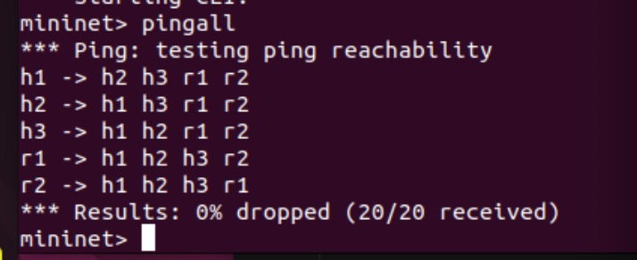
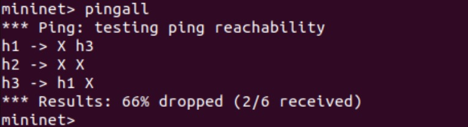

# Mininet_a3

### Introduction ###

    This project is built with the **Mininet API**. It simulate network topologies, helping users better understand how hosts, switches, and routers interact in a computer network.

### System Requirements: ###
    - Operating System: Ubuntu 22.04 LTS. 

    - Python: 3.x

    - Mininet API
### Files Struct: ###

    exp1.py : Demonstrates a basic topology with two routers and three hosts.

    exp2.py : Demonstrates a linear topology with two switches and OpenFlow rules.

# How to run: #

Excute the command by

    sudo python exp1.py or exp2.py

After you run it, If you want to test the ping between the nodes.

    hx ping -c 1 hx  (x stand for 1-3 )

Adding flows rule to the exp2.py:

    sudo ovs-ofctl add-flow s1 "in_port=2,actions=drop" (Drop all incoming flow on s1-eth2)

    sudo ovs-ofctl add-flow s1 "in_port=1,actions=output:3" (Send all incoming flow on s1-eth1 to s1-eth3)

# Excution Output: #
### **Pingall** for each exp1 and exp2: ###
exp1.py:

exp2.py:

### Result for exp1: ###
    h1 -> h3
    PING 10.0.2.2 (10.0.2.2) 56(84) bytes of data.
    64 bytes from 10.0.2.2: icmp_seq=1 ttl=62 time=0.539 ms

    --- 10.0.2.2 ping statistics ---
    1 packets transmitted, 1 received, 0% packet loss, time 0ms
    rtt min/avg/max/mdev = 0.539/0.539/0.539/0.000 ms

    h2 -> h3
    PING 10.0.2.2 (10.0.2.2) 56(84) bytes of data.
    64 bytes from 10.0.2.2: icmp_seq=1 ttl=62 time=0.326 ms

    --- 10.0.2.2 ping statistics ---
    1 packets transmitted, 1 received, 0% packet loss, time 0ms
    rtt min/avg/max/mdev = 0.326/0.326/0.326/0.000 ms

    h3 -> h1
    PING 10.0.0.1 (10.0.0.1) 56(84) bytes of data.
    64 bytes from 10.0.0.1: icmp_seq=1 ttl=62 time=0.082 ms

    --- 10.0.0.1 ping statistics ---
    1 packets transmitted, 1 received, 0% packet loss, time 0ms
    rtt min/avg/max/mdev = 0.082/0.082/0.082/0.000 ms

    h3 -> h2
    PING 10.0.3.2 (10.0.3.2) 56(84) bytes of data.
    64 bytes from 10.0.3.2: icmp_seq=1 ttl=62 time=0.050 ms

    --- 10.0.3.2 ping statistics ---
    1 packets transmitted, 1 received, 0% packet loss, time 0ms
    rtt min/avg/max/mdev = 0.050/0.050/0.050/0.000 ms

### Result for exp2: ###

    From h1 to h3:
    mininet> h1 ping -c 1 h3
    PING 10.0.0.3 (10.0.0.3) 56(84) bytes of data.
    64 bytes from 10.0.0.3: icmp_seq=1 ttl=64 time=5.09 ms

    --- 10.0.0.3 ping statistics ---
    1 packets transmitted, 1 received, 0% packet loss, time 0ms
    rtt min/avg/max/mdev = 5.088/5.088/5.088/0.000 ms

    From h2 to h3
    mininet> h2 ping -c 1 h3
    PING 10.0.0.3 (10.0.0.3) 56(84) bytes of data.
    From 10.0.0.2 icmp_seq=1 Destination Host Unreachable

    --- 10.0.0.3 ping statistics ---
    1 packets transmitted, 0 received, +1 errors, 100% packet loss, time 0ms

    mininet> 

